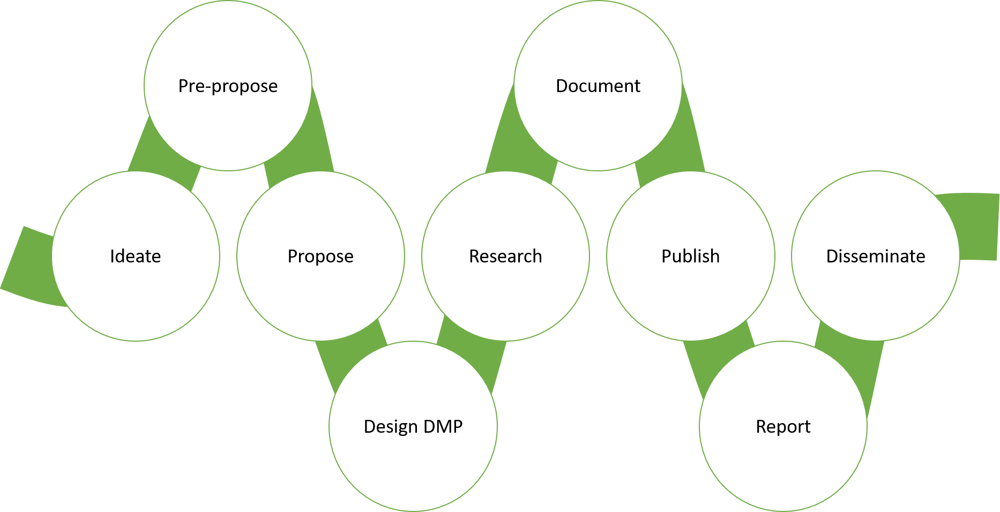
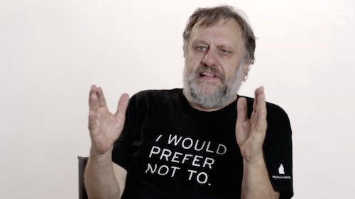
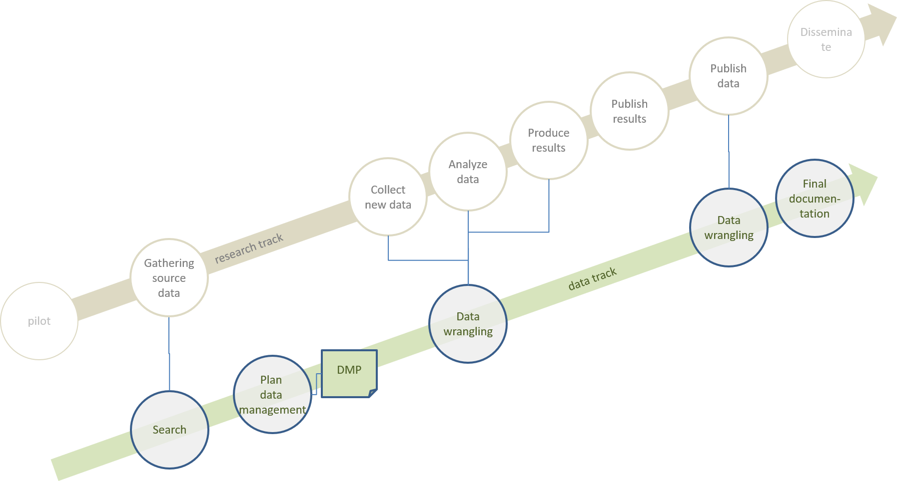

```{r setup, include = FALSE}
library(tidyverse)
knitr::opts_chunk$set(echo = FALSE)
```

## Introduction

<div class="notes">
Let's start with getting to know the participants: Who they are, and what their field of interest is. Hopefully, this is also the field they do their work in...

Let's also ask them *what type* of research they are doing - this helps us get an idea of which parts of Open Science might be most applicable to them.
</div>

Results of our little survey:

```{r group, include = FALSE, echo = FALSE}
group <- tibble(Name = c("Henrik"),
                Field = c("Bibliometrics"),
                Research = c("Statistics, coding, prose"))

knitr::kable(group)
```

## Topics du jour:

<div class="notes">
The topics of the workshop can be summarised in three main headings:
</div>

- The modern research cycle
- The Open Science movement
- Incorporating workflow thinking into your research


# Part I: The modern research cycle


## An idealised research project

As a researcher, in many ways, this is how you would want the ideal research project to look:

{.imgwide}

<div class="notes">
You come up with an idea, work out the ramifications and propose a project which gets funded, at which point you can do the "actual research". Then, you write it up, publish, and go on to flog the publication in your preferred flavour of social media. Repeat for the amount of publications feasible within the economic confines of the project.
</div>


## Requirements

...but then, you are not the one with the money (yet).

Many research funders now require the development of a heap of auxiliary information about the project: 

- Data management plan
- Publication plan
- Dissemination plan


## Data management plan

<blockquote>Research data should be shared and reused more widely [...] Better access to research data can boost innovation and value creation by enabling actors outside the research community to find new areas of application. </blockquote>
<font size="3">[National strategy on access to and sharing of research data](https://www.regjeringen.no/en/dokumenter/national-strategy-on-access-to-and-sharing-of-research-data/id2582412/)</font> 

- What do you collect?
- How do you treat it?
- How will you keep/share it?


## Publication plan

- Where do you plan to publish?
- What part of the project will make it into which publications?
- How do the publications fit into the overall project?


## The publishing cycle

{.img}


## The publishing cycle, really

{.imgwide}


## Dissemination plan

- How will you present your research?
- In which channels?


## Social media

{.img}

<font size="2">Mikki, S., M. Zygmuntowska, Ø. L. Gjesdal, H. A. Al Ruhewy (2015) [Digital Presence of Norwegian Scholars on Academic Network Sites—Where and Who Are They?](https://journals.plos.org/plosone/article?id=10.1371/journal.pone.0142709) *PLoS ONE*</font>

## A more realistic project plan

{.imgwide}

## Is this you?


<font size="2">Charlie Chaplin (1916) [*The Floorwalker*](http://publicdomainmovie.net/movie/charlie-chaplins-the-floorwalker-1916), Lone Star Corporation</font>


## Why all this stuff?

<blockquote> [W]e have two major points to consider. First, due to a lack of adequate incentives in the reward structure of professional science [...] actual replication attempts are rarely carried out. Second, to the extent that they are carried out, it can be well-nigh impossible to say conclusively what they mean, whether they are “successful” (i.e., showing similar, or apparently similar, results to the original experiment) or “unsuccessful” (i.e., showing different, or apparently different, results to the original experiment).</blockquote>

<font size="2">Earp, B. and D. Trafimov (2015) [Replication, falsification, and the crisis of confidence in social psychology](https://www.frontiersin.org/articles/10.3389/fpsyg.2015.00621/full). *Frontiers in Psychology*</font>

##
<div class="notes">
In 2009, I did some data collection in connection with my doctoral research regarding people's habits and considerations around the availability and price of electricity. The department had secured some external funding from various industry partners, and spent almost 250.000 NOK soliciting answers from 1500 Norwegians on a survey on this topic. To achieve 1500 answers they had to ask more than 22.000 people....

Once the data was in, I spent a lot of time analysing it and producing graphs that could be used in a publication. It was all based on the SPSS software for statistical analysis. SPSS very handily provides users with a menu-based graphical user interface that allows them to specify the parameters of statistical analysis without bothering them with the specifics of how the inputs are defined. 

It also creates a log file that can be used to recreate the procedure of several of these analysis steps at some future point in time. The only problem is that this log file of the scrips run under the hood is not brought to the attention of the researcher. So I never spent too much time worrying about how the data should be interpreted by someone else at some point in the future. The result is that no effort was spent in making legible the variables and any operations that were performed on them in order to produce the results that I based my publication on.

Eight years later, a researcher looking to do a meta-analysis on a collection of such survey data contacted me, asking me for the underlying data and some explanation of the relevant variable definitions. So I went looking for the data, and finally found them in a subfolder on my (now mostly inactive) Dropbox account.
</div>

This is the whole abstract of an interesting paper in the field of genomic biology:

<blockquote> The spreadsheet software Microsoft Excel, when used with default settings, is known to convert gene names to dates and floating-point numbers. A programmatic scan of leading genomics journals reveals that approximately one-fifth of papers with supplementary Excel gene lists contain erroneous gene name conversions. </blockquote>

<font size="2">Ziemann, M., Y. Eren, A. El-Osta (2016) [Gene name errors are widespread in the scientific literature](https://genomebiology.biomedcentral.com/articles/10.1186/s13059-016-1044-7). *Genome Biology* 17:177</font>


## Storytime

Here are some rows of some of the columns:

```{r storytime, include = TRUE, echo = FALSE}
storytime <- haven::read_sav("Datafil - Den deregulerte forbruker 041209_1.sav")

knitr::kable(storytime[1:5, 18:22])

```

- 
- Only problem: I don't know where I put the codebook!

## An all-too familiar story

<iframe width="640" height="385" src="https://www.youtube.com/embed/N2zK3sAtr-4?controls=0" frameborder="0" allow="accelerometer; autoplay; encrypted-media; gyroscope; picture-in-picture" allowfullscreen></iframe>

<font size="2">Hanson, K. A. Surkis and K. Yacobucci (2012) [*Data Sharing and Management Snafu in 3 Short Acts*](https://www.youtube.com/watch?v=N2zK3sAtr-4) CC-BY</font>

# Part II: How to deal with this?

## Just don't do it

{.imgwide}

## 

<div class="columns-2">

  {.imgtall}
  
  - Research habits change very slowly
    - Being too far ahead of the pack can be more work than it's worth
  - Funder mandates are actually minimal
  - There are few repercussions, if any


</div>

## Try to integrate the issues into your workflow

Can I set up my workflow in a way that is

- resource-efficient
- modular
- transparent and accountable

If I can, how much time and effort is it worth?


# Part III: Examples of digital workflows

## The general idea

{.imgwide}


## Collaborating

What is a modern way to ensure that the work I do with others is always updated and always available for everyone that I collaborate with?

- Sharepoint (requires institutional credentials)
- [Overleaf](www.overleaf.com) (becomes better with knowledge of the world's worst markup language, LaTeX)
- [Jupyter notebooks](https://jupyter.org/) / [RMarkdown](https://rmarkdown.rstudio.com/) (become better with coding knowledge)


## Keeping track

Version control software ensures integrity over time and context of text and other elements that you track with the software. Proper use guarantees against loss of work and goes a long wy towards ensuring transparency and accountability in the research process.

This is also a superior way of doing collaboration, as a repository can hold auxiliary files in addition to the text being edited, and all of it can be sent/updated in an integrated fashion.


## Documenting

If you treat your current publication as a small project in its own right, documentation can be done concurrently with project development. This requires a small upfront investment, but saves a lot of work downstream and improves the quality of the work in the process.

Remember, documentation is not just about computer code or statistical data - any form of analysis that is actually *processing information* will require a thorough demonstration of this processing to show how you arrive at the conclusions you present in the text. This includes stuff like text analysis or qualitative interview data.


## Sharing

Once you have everything done and would like to share your results, how do you do it?

- Repository
  - [Zenodo](https://zenodo.org/), for citable dissemination of code, data and text.
  - Github
- Preprint server
  - [arXiv](https://arxiv.org)
  - [OSF preprints](https://osf.io/preprints/)


## Disseminating

The workflow thinking described above actually greatly eases the work connected to dissemination. Not only are the different parts of your research properly documented, linkable, shareable and citable, but using integrated development environments enables the production of many kinds of output from the same source.


## The trade-offs

There are powerful, efficient tools at our disposal that can both mitigate against administrative burnout and improve the quality of our work and the workflow experience itself.

There is, however, a learning curve of varying steepness to integrate these things into an existing workflow. Is the time and effort worth it? Different researchers will have differing comfort levels regarding this.


## Resources
[Foster Open Science](https://www.fosteropenscience.eu/), the EU educational resource for Open Science.

[Open Science MOOC](https://opensciencemooc.eu/), coursework on Open Science principles and tools.

NTNU policies on [Open Access publishing](https://innsida.ntnu.no/wiki/-/wiki/Norsk/NTNU+Open+Access+-+handlingsplan) and [Open Data](https://innsida.ntnu.no/wiki/-/wiki/English/NTNU+Open+Data).

[National policies](https://www.regjeringen.no/en/dokumenter/national-strategy-on-access-to-and-sharing-of-research-data/id2582412/sec1) on the same.
