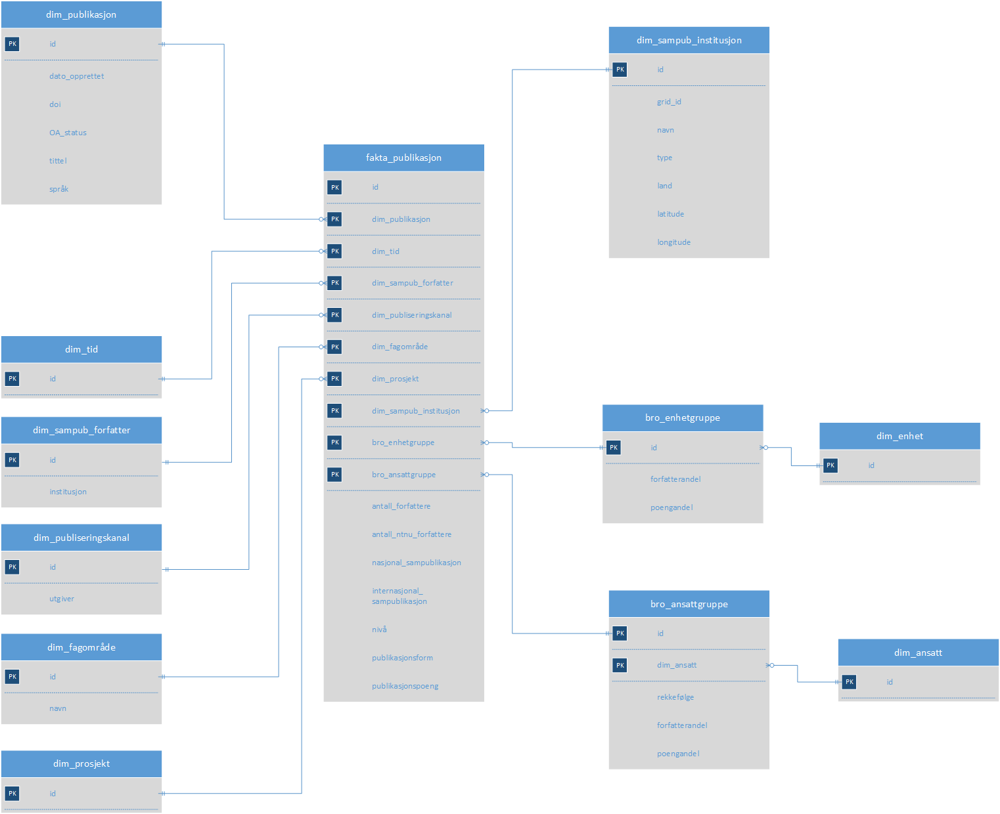

```{r setup, include=FALSE}
library(rcristin)
library(dplyr)
library(magrittr)
library(ggplot2)
knitr::opts_chunk$set(echo = FALSE)
```

## Tema for dagen

- Cristindata i NTNUs virksomhetsstyring

- Script for full import av Cristindata

- En R-pakke for Cristin API

- Bruk av rcristin i applikasjoner 


## Bevisst - NTNUs virksomhetsstyringssystem

- Koblete virksomhetsdata

- Sikrer datakvalitet og konsistent fortolkning

- Kilder >> Integrasjon >> Datavarehus >> Presentasjon


## Datamodell for publikasjoner

{width=650px}

## Høsting av Cristin

- Utviklet og testet i R

- Implementert i python

```{r pydemo, echo = TRUE, eval = FALSE}

def writeCSV_pub(data,page,row,export):
    
    if page==1 and row==0 and os.path.exists(export):
        os.remove(export)
        logging.info('file removed')
    
    fname=open(export,'a',encoding='utf-8',newline='')
    key_fields=('cristin_result_id','original_language','issue',
                'DOI_url','category_code','category_name','title',
                'year_published','created','journal_name',
                'journal_nvi_level','value','type')
    new_data={k:data[k] for k in key_fields if k in data}

```


## rcristin

Pakke for kommunikasjon med Cristin API

Spesifiser søkeparametre og analysebehov og få tilbake en enkel tabell med relevant informasjon

Prøv selv, med:

```{r demo, echo = TRUE, eval = FALSE}
devtools::install_github("henrikkarlstrom/rcristin")
library(rcristin)
```


## Format

```{r falskfront, echo = TRUE, eval = FALSE}
get_cristin_results(contributor = "25062") %>%
  select(cristin_result_id, title, journal.name)
```

```{r henrik}
suppressMessages(get_cristin_results(contributor = "25062") %>%
  select(cristin_result_id, title, journal.name))
```


## Bruk i grafisk fremstilling

Vi kan hente publikasjoner fra NTNU Universitetsbiblioteket
```{r ntnuub, echo = TRUE, eval = FALSE}
get_cristin_results(unit = "194.14.30.0",
                    published_since = 2015)
```

```{r suppress}
ntnuub <- suppressMessages(get_cristin_results(unit = "194.14.30.0", 
                              published_since = 2015))
```

- og fremstille det vi finner interessant med dem grafisk:

```{r ubplot, fig.height = 3}
ntnuub$open_access <- forcats::fct_rev(factor(ntnuub$open_access))
ntnuub$open_access <- dplyr::recode(ntnuub$open_access,
                                    none = "Ikke arkivert",
                                    green = "Arkivert",
                                    gold = "Gull OA")
ggplot(data = ntnuub,
       aes(x = year_published,
           fill = open_access)) +
  geom_bar() +
  geom_hline(yintercept = 0,
             size = 1,
             colour = "#333333") +
  labs(title = "OA-status NTNU Universitetsbiblioteket",
       subtitle = "2015-2019") +
  theme(plot.title = element_text(size = 20,
                                  face = "bold",
                                  color = "#222222"),
        plot.subtitle = element_text(size = 18),
        legend.title = element_blank(),
        legend.text = element_text(size = 12,
                                   color = "#222222"),
        axis.title = element_blank(),
        axis.ticks = element_blank(),
        panel.grid.minor = element_blank(),
        panel.grid.major.y = element_line(color="#cbcbcb"),
        panel.grid.major.x = element_blank(),
        panel.background = element_blank()
        ) +
  scale_y_continuous(limits = c(0, 10),
                     breaks = c(2, 4, 6, 8, 10)) +
  scale_fill_manual(values = c("grey", "darkgreen", "gold"))
```


## Bruk av R til applikasjoner

<div class="notes">
John-Arne Røttingen: 23711
Folkehelseinstituttet: 7502.2.0.0
</div>

- Kode er skummelt, selv om den bare er en linje lang, så hvorfor ikke bare ta bort hele programmeringsspråket og R-terminalen?

- R + Shiny = Grafisk applikasjonslag på toppen av kode

- Hva med [en liten presentasjon](https://henrikkarlstrom.shinyapps.io/rcristindemo/)?


## Videre

- Dokumentasjon

- Funksjonalitet

- Grafisk fremstilling i stedet for tabulær

- Hva vil DU gjøre?